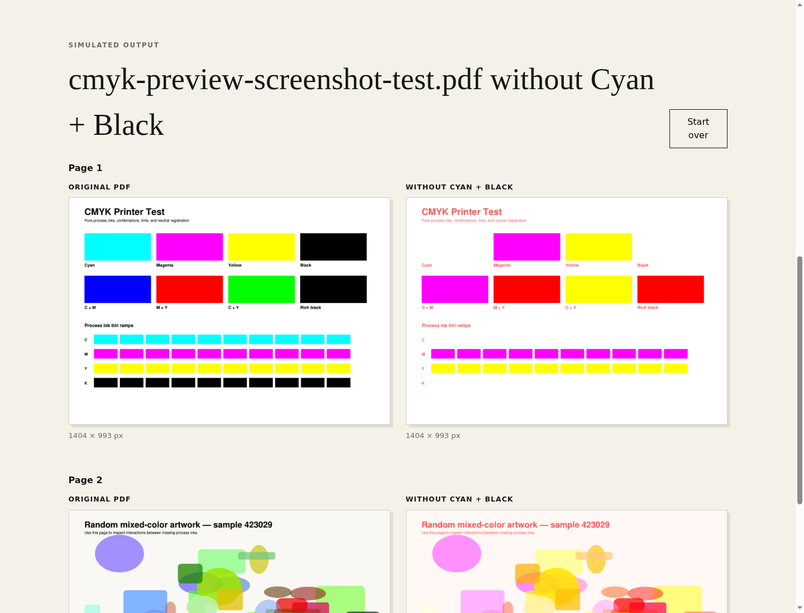
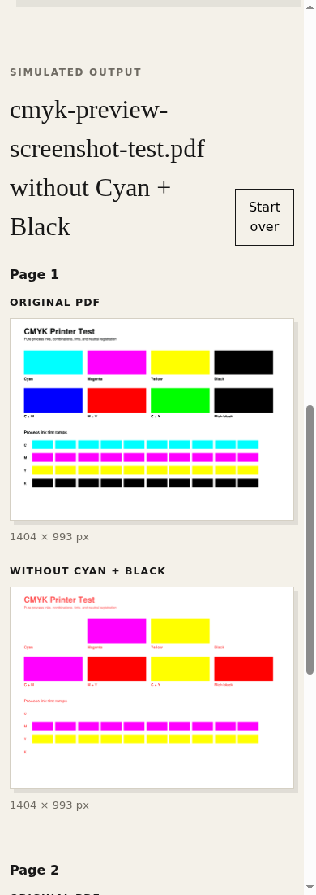

# CMYK Preview

Upload a PDF, select the printer ink that is not working, and compare every original page with a browser-rendered approximation of the missing-ink output.



The comparison view keeps the original PDF page and the simulated page at the same dimensions. On smaller screens, each pair stacks vertically so the difference remains readable.



## What it does

- Accepts one PDF at a time, up to 100 MB, with no page-count limit.
- Simulates Cyan, Magenta, Yellow, Black, or any combination of missing inks.
- Shows original and simulated output side by side for every page.
- Preserves native PDF CMYK separations when MuPDF exposes them.
- Generates a two-page process-ink diagnostic PDF from **Download test PDF**.
- Processes uploads in memory; files are not retained by the application.

This is an approximation for diagnosis and planning, not a color-managed press proof. Paper, printer profiles, overprinting, spot colors, and device calibration can change physical output.

## Run locally

```bash
uv sync
uv run uvicorn app.main:app --reload --port 8080
```

Open <http://127.0.0.1:8080>.

## Docker

```bash
docker compose up --build
```

The container exposes the app at <http://127.0.0.1:8080> and includes a health check.

## Formatting

```bash
uv run ruff check app --fix
uv run ruff format app
```

Ruff and the workspace settings enforce four-space Python indentation. VS Code formats Python files with Ruff on save.

## API endpoints

| Method | Endpoint | Purpose |
| --- | --- | --- |
| `GET` | `/` | Serves the web interface |
| `GET` | `/health` | Container/process health check |
| `GET` | `/api/test-pdf` | Downloads a generated diagnostic PDF |
| `POST` | `/api/preview` | Renders a PDF with selected missing inks |
